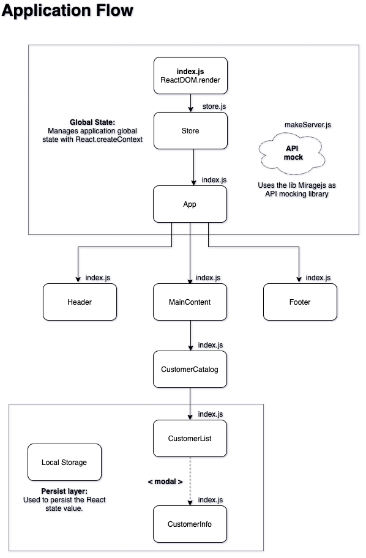

# History

This file documents the decisions made during the app development.


<br>

### `create-react-app`
The inital structure of this project was generated with the [create-react-app](https://pt-br.reactjs.org/docs/create-a-new-react-app.html) SPA boilerplate. 
The objective of this decision was to improve time since it already uses the setup of Webpack as module bundler and Babel as JavaScript compiler to convert code into a backwards compatible version of JavaScript.
<br> 
This is an point where not necessarily the quality was sacrificed in favour of speed but create-react-app command automates an important part of the project structure which bring pros and cons, some of the cons in my opinion are:
```
- The process of creating the project structure brings good knowledge;

- Some libs, like Babel, can receive customize options for the project and using the command to generate the project structure the chance to personalize it according to the context is taken away;

- Not necessary libs and/or scripts increasing the project bundle;
```
<br>

### `code style`
- The [Prettier](https://prettier.io/) lib was used as an code formatter.
- The [ESLint](https://eslint.org/) lib was used for best practices code analysis.

<br>

### `app style`
The [nodes-sass](https://www.npmjs.com/package/node-sass) lib was used to make the binding between de Node and [Sass](https://sass-lang.com/) that was choosing as CSS preprocessor.
The objective of this decision was to keep the CSS more elegant using Sass features like variable and mixin.

<br>

### `server`
The [miragejs](https://miragejs.com/) lib was used to mock and handle the API data provided. 
The objective of this decision was to fetch and test the application request really simulating the backend services.

<br>

### `global state`
The global state of the application was manages using the [React Context API](https://pt-br.reactjs.org/docs/context.html) and [useReducer](https://pt-br.reactjs.org/docs/hooks-reference.html#usereducer).
The objective of this decision was to implement an reducer without needing all the complex implementation that [Redux](https://redux.js.org/) brings. `useReducer` manages the component state logic better thatn `useState` when it envolves multiple values being passed through components. <br>
The global state logic is present at [AppContext](./src/components/AppContext/store.js) component.

<br>

### `local storage`
To main the global state data that is being handled alive during the application life I decided to use the [localStorage](https://developer.mozilla.org/pt-BR/docs/Web/API/Window/localStorage).

<br>

### `comming next`:
Here are some points that I've listed but didn't had time to work on:

- Interface tests to check components visibility on screen; 
- Improve total budget input:
  - Create an debounce for the `handleChange` method;
  - Create more user friendly visual validations (like, border red at empty required fields etc).
- Improve fetchs for API:
   - Create some kind of orchestrator to centralize the fetchs, gathering the common points to keep the code more reusable and cleaner.
- [Bugfix] When saving an new value for more than one company total budget, then reloading the page and saving another value, some of the companies that the total budget was updated where being reseted;
- Configure [Git Hooks](https://git-scm.com/book/en/v2/Customizing-Git-Git-Hooks) for development worflow.

<br>

---

### Draw of the application flow:
<br>



---

<br>

## Thats all folks!